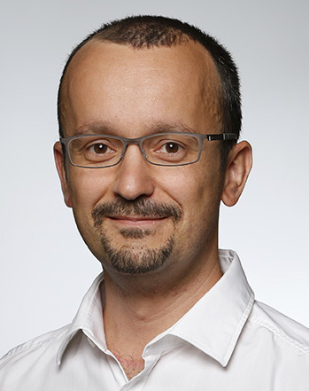
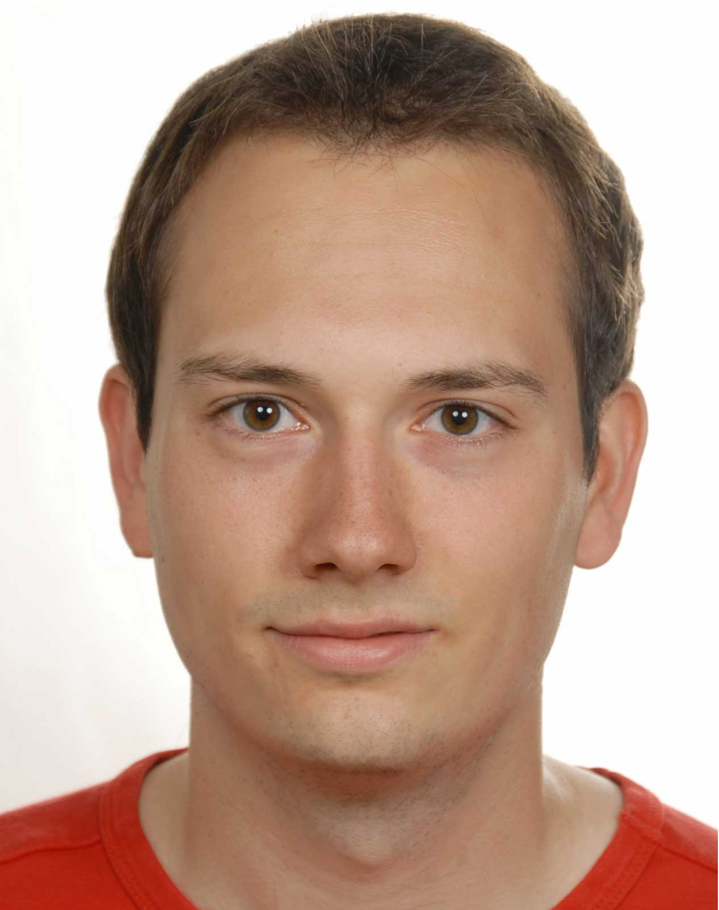
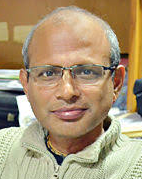

----

<a name="toc"/>

<a href="#overview">Overview</a> &middot;
<a href="#speakers">Invited Speakers</a> &middot;
<a href="#topics">Relevant Topics</a> &middot;
<a href="#audience">Intended Audience</a> &middot;
<a href="#call">Call for Papers</a> &middot;
<a href="#dates">Important Dates</a> &middot;
<a href="#schedule">Schedule</a> &middot;
<a href="#organizers">Organizers</a>

----

<a name="overview"/>

Industry 4.0 will be driven by two main technologies: AI and Robotics. The combination of both allows robots to learn skills and tasks without explicitly programming them. Data-driven robot learning algorithms offer an untapped potential for significantly reducing robot programming cost, optimizing robot movements and enabling new robot application. Current learning algorithms, however, require a lot of data to learn complex industrial tasks. The generation of this data by real robots is cost-intensive and time-consuming. Simulations are attractive environments for training robots as they provide an abundant source of cheap, scalable and safe data. On the other hand, behaviors developed by agents in simulation are often specific to the characteristics of the simulator, and physics simulators do not reflect the physical world sufficiently well. Due to modelling errors, strategies that are successful in simulation may not transfer to their real world counterparts ("reality gap"). 

This workshop is named after the Indo-German research project 'TransLearn' which addresses the above-mentioned topics. The workshop organizers are conducting this project and invite authors to submit papers relevant to this theme.

The aim of this workshop is to discuss and share ideas in relation to the 'TransLearn' project and transfer learning in general. The workshop is intended for robot and machine learning researchers as well as manufacturing and warehouse automation practitioners. Particular objectives of this workshop are to:

- Develop a community of researchers working on learning robot skills and tasks in industrial applications
- Discuss the current state of the art and future directions for bridging the gap between simulation and reality in robotic manipulation
- Provide collaboration opportunities 

<a name="speakers"/>
## Invited Speakers <a href="#toc" class="top-link">[Top]</a>

- Dr. Rainer Bischoff, Head of KUKA Corporate Research
- Prof. Laxmidhar Behera, IIT Kanpur
- Prof. Torsten Kröger, Karlsruhe Institute of Technology
- Dr. Balamuralidhar P, TATA Consultancy Services

<a name="topics"/>
## Relevant Topics <a href="#toc" class="top-link">[Top]</a>

This workshop aims at discussing
- different technological aspects of sim-to-real transfer in the context of machine learning for robots
- current challenges in manufacturing and warehouse automation

Contributions to the workshop may address but are not limited to the following aspects:
- Robot learning in simulation
- (Deep) reinforcement learning for robots
- Physics simulators for reinforcement learning
- System identification with physical robots
- Domain randomization for sim-to-real transfer
- Imitation learning / learning by demonstration on physical robots
- Multi-robot path planning in warehouse automation
- (Cloud-based) physics simulators for warehouse automation
- Vision-based grasping and assembly in manufacturing or warehouse automation 

<a name="audience"/>
## Intended Audience <a href="#toc" class="top-link">[Top]</a>
Researchers and engineers that develop methods and systems for learning physical manipulation tasks, in particular:
- Reinforcement learning and machine learning communities addressing sim-to-real transfer learning
- Physics simulation communities with interest in robot learning
- Communities dedicated to imitation learning / learning by demonstration
- Researchers focussing on path planning for multi-robot coordination 
- Industry practitioners in manufacturing or warehouse automation

<a name="call"/>
## Call for Papers <a href="#toc" class="top-link">[Top]</a>

The workshop invites papers relevant to the theme and the topics laid out above. 
We encourage the submission of application-oriented and system papers demonstrating the application of deep learning and reinforcement learning methods for real-world use-cases.

The manuscript should be prepared using the standard IEEE Ro-MAN 2019 [template](https://ro-man2019.org/papers). The maximum page length allowed is **4 pages excluding references**. 
The papers should be submitted using the [EasyChair](https://easychair.org/conferences/?conf=translearn2019) conference management system.

<a name="dates"/>
## Important Dates <a href="#toc" class="top-link">[Top]</a>

* Submission deadline: July 15, 2019: 23:59 Pacific Time (UTC-7)
* Acceptance notification: August 31, 2019
* Submission of camera-ready paper: September 10, 2019

<a name="schedule"/>
## Workshop Schedule <a href="#toc" class="top-link">[Top]</a>

|---------------|--------------------------------------------------------------------|
| 09:00 - 09:15 | Inauguration & Welcome Speech                                      |
|---------------|--------------------------------------------------------------------|
| 09:15 - 10:30 | Invited Talks Session I                                            |
| 10:30 - 11:00 | Tea Break                                                          |
| 11:00 - 12:00 | Paper Presentation Session I                                       |
|---------------|--------------------------------------------------------------------|
| 12:00 - 13:15 | Invited Talks Session II                                           |
| 13:15 - 14:15 | Lunch Break                                                        |
| 14:15 - 15:15 | Paper Presenatation Session II                                     |
|---------------|--------------------------------------------------------------------|
| 15:15 - 16:15 | Panel Discussion                                                   |
|---------------|--------------------------------------------------------------------|
| 16:15 - 16:30 | Closing Ceremony                                                   |
|---------------|--------------------------------------------------------------------|

<a name="organizers"/>
## Organizers <a href="#toc" class="top-link">[Top]</a>

|  | [Daniel Braun](mailto:daniel.braun@kuka.com), KUKA, Germany  Daniel Braun received his „Diplom-Ingenieur" in Electrical Engineering and Information Technology in 2005 from the University of Karlsruhe (TH). In 2012 he received his doctorate degree in Informatics from the Karlsruhe Institute of Technology (KIT), Germany. In 2013, he joined KUKA as a project manager for cooperative research projects. His interest lies in the integration of complex robotic solutions in the field of autonomous mobile manipulation.|
|  | [Manuel Kaspar](mailto:manuel.kaspar@kuka.com), KUKA, Germany  Manuel Kaspar received his Master of Science in Computer Engineering in 2017 from the University of Augsburg. In 2017 he joined the KUKA Group as a developer in the Cluster Smart Data and Infrastracture concerned with Machine Learning in robotics. Additionally, he received a Bachelor of Arts in philosophy in 2014 from the Hochschule für Philosophie in Munich.| 
|   | [Jonas Kiemel](mailto:jonas.kiemel@kit.edu), Institute for Anthropomatics and Robotics, Karlsruhe Institute of Technology, Germany   Jonas Kiemel received a master's degree with distinction in 2018 after studying Electrical Engineering and Information Technology at the Karlsruhe Institute of Technology . His research focuses on accelerating learning with industrial robots by an intelligent combination of simulated and real data. This includes learning robust policies despite the inevitable gap between simulated and real data as well as safe exploration with real robots.|
|   | [Swagat Kumar](mailto:swagat.kumar@tcs.com), TATA Consultancy Services, India  Swagat Kumar obtained his PhD in EE from IIT Kanpur. He is currently heading the robotics research group at TCS. He has close to 10 years of postdoctoral experience in both academia and industry. His research interest includes robotics, computer vision and machine learning.|
|  | [Laxmidhar Behera](mailto:lbehera@iitk.ac.in), IIT Kanpur, India  Laxmidhar Behera (S’92-M’03-SM’03) received the B.Sc. and M.Sc. degrees in engineering from NIT Rourkela, India, in 1988 and 1990, respectively , and the Ph.D. degree from the IIT Delhi, India. He pursued his postdoctoral studies in the German National Research Center for Information Technology, Sank Augustin,  Germany, in 2000-2001. He was an Assistant Professor with the BITS  Pilani, India 1995-1999. He is currently a Professor with the Department of Electrical Engineering, IIT Kanpur, India. His research interests include intelligent control, robotics, neural networks, and cognitive modeling. He is a senior member of IEEE and a fellow of INAE.|
|   | [Pascal Meißner](mailto:pascal.meissner@kit.edu), Institute for Anthropomatics and Robotics, Karlsruhe Institute of Technology, Germany  Pascal Meißner holds a M.Sc. degree (Dipl.-Inform.) in computer science from Karlsruhe Institute of Technology (KIT). His M.Sc. supervisor has been Prof. Dr.-Ing. Ruediger Dillmann. He currently leads the research group "ROLE - Robot Learning Group" in the Intelligent Process Automation and Robotics Lab at KIT. His research interests include robot learning (of compound actions), robot programming by demonstration and scene understanding.|
|   | [Rajesh Sinha](mailto:rajesh.sinha@tcs.com), TATA Consultancy Services, India  Rajesh Sinha is a Chief Scientist at TCS Research and Innovation and heads the Smart Machines and Autonomous Infrastructure Research Program. He has over 20 years of experience in building engineered software and hardware solutions for Transportation, Logistics, Retail, and Government applications for TCS and for start-ups. His areas of interest are robots, drones, augmented reality platforms, and smart vision. Rajesh holds a degree in Electrical and Electronics Engineering from BITS Pilani and a Masters in Comparative Religion.|

